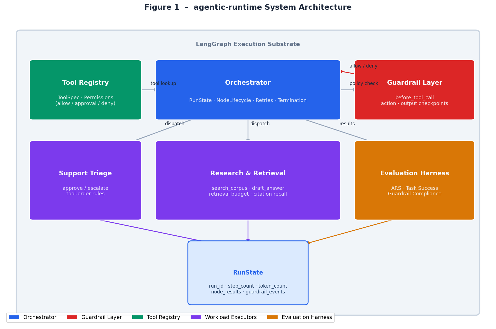
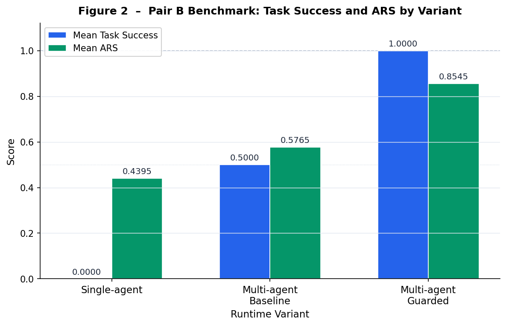
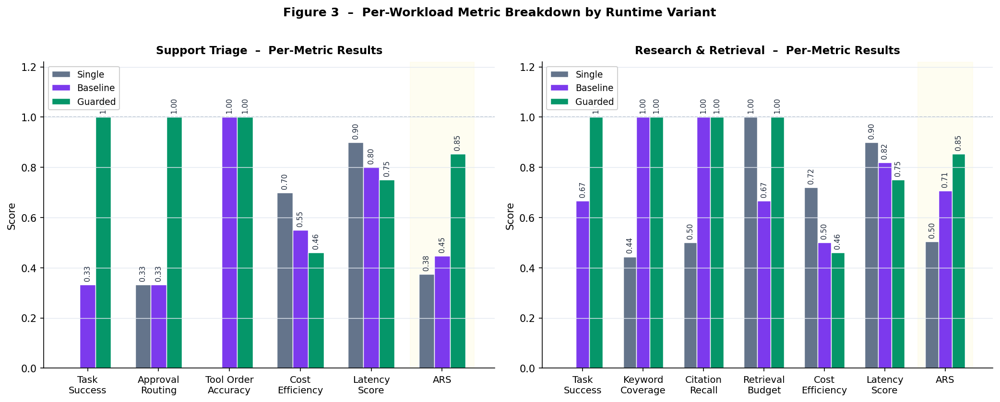

Guardrails as Runtime Policy: An Orchestration Architecture and Evaluation Framework for Reliable Multi-Agent Systems
## Bharat Khanna
Independent Researcher, Phoenix, United States
## khanna.bharat@gmail.com
## Abstract
Large language model agents are increasingly deployed as multi-step systems that plan, invoke tools, retrieve external context, and produce user-facing actions. In practice, however, most agent stacks still treat safety and reliability controls as wrappers around model input and output rather than as first-class runtime behavior. This separation creates a systems problem: an agent may produce a plausible final answer while still taking an unsafe, wasteful, or operationally incorrect trajectory. This paper presents `agentic-runtime`, a LangGraph-assisted runtime architecture that integrates guardrails into orchestration checkpoints rather than attaching them only at the edges of the application. The runtime centers on typed tool contracts, explicit run state, bounded execution, and policy decisions recorded during graph execution. We evaluate the design on two workload families chosen to expose different failure surfaces: support triage and research-and-retrieval. Across three benchmark variants, single-agent, multi-agent baseline, and multi-agent guarded, the guarded runtime achieves a mean task success rate of 1.0 and mean Agent Reliability Score (ARS) of 0.8545, compared with 0.5 and 0.5765 for the multi-agent baseline and 0.0 and 0.4395 for the single-agent baseline. The results suggest that orchestration-level guardrails materially improve approval routing, evidence discipline, and end-to-end reliability, while introducing measurable but bounded efficiency trade-offs. The paper contributes both a practical runtime architecture and an evaluation method for comparing agent systems on reliability, guardrail compliance, latency, and cost.

Keywords: Agent systems, Multi-agent orchestration, Guardrails, Runtime policy, Tool use, Evaluation, Retrieval-augmented generation, LangGraph
## 1. Introduction
Agent systems have shifted the practical center of gravity of LLM engineering from prompt design to systems design. Once an application is allowed to retrieve context, call tools, update state, and continue across multiple decision points, correctness depends not only on the text of the final answer but also on the path taken to produce it. An answer can be syntactically well formed and still be operationally wrong if the agent called the wrong tool, skipped an approval boundary, used irrelevant retrieval context, or exceeded a budgeted execution path.

This creates a gap between how many teams evaluate agents and how agents actually fail in production. Most common guardrail implementations act as perimeter filters: they inspect user input before the first model call or inspect model output just before it is returned to the user. These controls are useful but incomplete. They do not reason over the agent's internal execution state, do not consistently govern tool authorization, and do not provide a principled way to compare runtime configurations across reliability, cost, and safety.

The central claim of this paper is that guardrails should be modeled as runtime policy checkpoints inside orchestration. Under this view, the runtime, not only the model prompt, is responsible for determining whether a tool call may proceed, whether approval is required, whether retrieval behavior stays within budget, and whether the resulting trajectory should continue. This paper formalizes that position in a concrete implementation: `agentic-runtime`, a LangGraph-assisted runtime built around explicit run state, typed tool boundaries, policy-aware execution, and reproducible evaluation.

The paper makes four contributions. First, it presents a runtime architecture in which guardrail decisions are embedded in orchestration checkpoints rather than isolated as edge filters. Second, it defines a Pair B benchmark program covering two heterogeneous workloads: support triage and research-and-retrieval. Third, it introduces the Agent Reliability Score (ARS), a composite metric that summarizes task success, cost efficiency, latency discipline, and guardrail compliance. Fourth, it reports executable benchmark results showing that the guarded runtime outperforms weaker baselines on both workloads.

The remainder of the paper is organized as follows. Section 2 defines the problem setting and failure model. Section 3 describes the runtime architecture. Section 4 explains guardrails as runtime policy. Section 5 presents the workloads and benchmark design. Section 6 defines the evaluation framework. Section 7 reports experimental results. Section 8 discusses implications and limitations. Section 9 reviews related work. Section 10 concludes.
## 2. Problem Setting and Failure Model
Production agent systems fail in ways that are not captured by final-answer inspection alone. We focus on five failure classes.

1. Invalid tool invocation. The agent proposes a tool that is not registered, not permitted in the current context, or should be gated behind human approval.
2. Unsafe action selection. The agent selects an operational action such as escalation or refund issuance without satisfying policy conditions.
3. Trajectory failure. The agent eventually reaches the correct answer but does so via an incorrect or wasteful sequence of tool calls.
4. Context-control failure. The agent retrieves too much irrelevant context, misses necessary evidence, or fails to preserve grounding between retrieved material and the answer.
5. Budget and observability failure. The system has no explicit record of how many steps were taken, how many tokens were consumed, or where the runtime blocked or allowed a risky transition.

These failures motivate a runtime model with four assumptions. First, the agent is multi-step rather than a single completion. Second, tools are exposed through typed contracts with explicit permissions. Third, the runtime maintains observable state across the lifetime of a task. Fourth, the runtime can deny, defer, or allow execution at policy checkpoints.

Under these assumptions, correctness becomes a joint property of output quality, execution path, and policy compliance. That systems framing distinguishes runtime reliability from prompt-only behavior.
## 3. Runtime Architecture
### 3.1 Design Principles
The architecture follows five principles.

- orchestration-first control
- typed boundaries for tool use
- explicit run-state transitions
- bounded autonomy through policy and step limits
- measurement-first implementation

### 3.2 Core Components

**Figure 1.** agentic-runtime system architecture. The Orchestrator (centre) owns RunState and node lifecycle. The Guardrail Layer evaluates policy at named checkpoints and returns allow/deny decisions. The Tool Registry exposes typed ToolSpec entries with explicit permission levels. Workload Executors (Support Triage and Research & Retrieval) dispatch through the Orchestrator and write results to the shared RunState. The Evaluation Harness consumes RunState to compute ARS and per-metric scores.

The runtime is organized around the following components.

Orchestrator. The orchestrator owns the run state, node lifecycle, retries, and termination behavior. It decides when a node becomes ready and when a run becomes blocked, failed, or completed.

Guardrail layer. Guardrails are evaluated at named checkpoints such as `before_tool_call`, support-triage action routing, and research retrieval or drafting steps. Each decision records whether execution is allowed, a rationale, and simple risk or confidence scores.

Tool registry. Tools are registered through typed specifications that include a name, description, and permission level such as `allow`, `approval_required`, or `deny`.

Workload executors. Each workload defines a graph shape and a deterministic execution path that can be evaluated repeatedly for research-grade comparison.

Evaluation harness. Deterministic scorers compute task success and workload-specific correctness metrics. The benchmark runner aggregates these into workload summaries and ARS.

### 3.3 LangGraph Integration Model
LangGraph serves as an execution substrate rather than the research contribution itself. The novelty in `agentic-runtime` lies in the runtime policy layer, the explicit run-state model, and the evaluation methodology. This separation is important because the paper does not claim a new graph engine. It claims that guardrail placement inside orchestration changes runtime behavior in measurable ways.

### 3.4 Run State and Policy Checkpoints
The runtime maintains a `RunState` containing a run identifier, objective, step count, token count, node statuses, node results, guardrail events, and runtime observations. A guardrail decision is recorded as a structured event with a checkpoint name, allow or deny outcome, rationale, and simple risk and confidence values.

The current prototype exercises policy at tool-permission boundaries. For example, approval-requiring tools such as `issue_refund` or `escalate_incident` are denied unless approval is explicitly granted. Safe tools such as `lookup_customer`, `search_corpus`, or `draft_answer` are allowed but still recorded as checkpoint events.
## 4. Guardrails as Runtime Policy
### 4.1 Why Edge-Only Guardrails Are Insufficient
Edge filters are useful for rejecting obvious prompt injection strings or malformed output, but they cannot govern a trajectory that unfolds over several steps. By the time a final answer is generated, the unsafe decision may already have been executed. Similarly, a retrieval-heavy workload may produce an apparently sound answer even if it violated retrieval budgets or failed to cite the correct sources.

This is why runtime placement matters. The guardrail has access to the current node, the requested tool, the registered permission level, and the accumulated execution state. That visibility allows the runtime to make a state-aware policy decision instead of a static content-only judgment.

### 4.2 Checkpoint Types
The runtime architecture supports four conceptual checkpoint classes.

- input guardrails: validate incoming requests
- reasoning guardrails: detect loops or invalid transitions
- action guardrails: govern tool authorization and approval requirements
- output guardrails: validate formatting, evidence, or policy conformance of the final answer

The current implementation emphasizes action guardrails because they are the most concrete and falsifiable with a small deterministic benchmark suite.

### 4.3 Policy Example: Approval-Required Actions
Support triage demonstrates why action guardrails matter. In the guarded variant, actions such as `issue_refund` and `escalate_incident` require approval. In the unguarded baseline, those actions proceed without a runtime policy check. This difference surfaces directly in the benchmark results: approval-routing correctness rises from 0.3333 in the multi-agent baseline to 1.0 in the guarded runtime.

### 4.4 Runtime Implications
Embedding guardrails in orchestration changes the runtime in three ways. First, policy decisions become observable execution artifacts rather than implicit prompt behavior. Second, the system can quantify guardrail compliance as a first-class evaluation dimension. Third, guardrails can be compared directly against cost and latency metrics rather than treated as unmeasured safety wrappers.
## 5. Workloads and Benchmark Design
### 5.1 Pair B Workloads
The benchmark design centers on two workload families.

Support triage represents an operational workflow. Cases include enterprise login outages, billing refund requests, and password reset support. The workload stresses tool routing, approval gating, escalation behavior, and deterministic tool-order checks.

Research-and-retrieval represents a knowledge workflow. Cases ask about prompt injection handling, memory compaction, and typed tool contracts. The workload stresses retrieval discipline, grounding, citation recall, and context-control behavior.

The pair was chosen because it spans two different failure surfaces. Support triage emphasizes operational risk and approval routing. Research-and-retrieval emphasizes evidence selection and context quality. Together they provide broader coverage than two operational tasks or two retrieval tasks would.

### 5.2 Benchmark Variants
Three runtime variants are evaluated.

Single-agent. A simplified path with reduced tool structure and weaker retrieval or action discipline. This variant functions as the weakest baseline.

Multi-agent baseline. A graph-structured runtime without integrated policy enforcement. This variant preserves some orchestration structure but does not apply runtime guardrails.

Multi-agent guarded. The full runtime with orchestration-level guardrail checkpoints and explicit approval behavior.

### 5.3 Deterministic Evaluation Rules
Support triage is scored using exact checks for severity, route, action, approval-routing correctness, and expected tool order. Research-and-retrieval is scored using required-keyword coverage, citation recall, forbidden-keyword absence, and retrieval-budget compliance.

This deterministic setup is intentionally modest. The current paper prioritizes reproducibility and falsifiability over evaluator sophistication.
## 6. Evaluation Framework
### 6.1 Core Metrics
The benchmark suite uses the following metrics.

Task success rate. Fraction of cases that satisfy all workload-specific correctness conditions.

Guardrail compliance. For support triage this is approval-routing correctness. For research-and-retrieval it is the mean of citation recall and retrieval-budget compliance.

Cost efficiency. A normalized runtime observation representing the relative efficiency of the variant. In the current prototype, this is derived from token and step proxies rather than external billing APIs.

Latency score. A normalized runtime observation based on bounded execution behavior.

Trajectory correctness. In support triage this is tool-order accuracy. In research-and-retrieval it is partially reflected through retrieval and citation discipline.

### 6.2 Agent Reliability Score
We define Agent Reliability Score as:

$$
ARS = \frac{w_s S + w_c C + w_l L + w_g G}{w_s + w_c + w_l + w_g}
$$

where:

- $S$ is task success
- $C$ is normalized cost efficiency
- $L$ is normalized latency score
- $G$ is guardrail compliance

The current prototype uses weights $w_s = 0.35$, $w_c = 0.20$, $w_l = 0.15$, and $w_g = 0.30$.

ARS is not presented as a universal metric. It is a comparative runtime metric for this benchmark setting. Its purpose is to summarize trade-offs across variants without replacing the raw metrics.
### 6.3 Experimental Setup
All workloads, runtime variants, scorers, and benchmark reports are implemented in the accompanying `agentic-runtime` codebase. The benchmark reports used in this paper are generated from executable code and saved under `benchmarks/reports/`. The deterministic prototype currently evaluates three cases per workload, for six total cases across the Pair B benchmark.
## 7. Experimental Results
### 7.1 Overall Comparison
Table 1 reports the mean results across all three variants.

Table 1: Pair B benchmark comparison across runtime variants

| Variant | Mean Task Success | Mean ARS |
|---|---:|---:|
| Single-agent | 0.0000 | 0.4395 |
| Multi-agent baseline | 0.5000 | 0.5765 |
| Multi-agent guarded | 1.0000 | 0.8545 |

**Figure 2.** Mean Task Success and Mean ARS across the three Pair B runtime variants. The guarded runtime reaches perfect task success (1.0) and an ARS of 0.8545, compared with 0.5 / 0.5765 for the multi-agent baseline and 0.0 / 0.4395 for the single-agent baseline.

The guarded runtime outperforms both weaker baselines on mean task success and mean ARS. The difference between the multi-agent baseline and the guarded runtime is particularly important because both share a graph-oriented structure; the main distinction is the presence of orchestration-level policy enforcement.

### 7.2 Support Triage Results
Table 2 reports the support triage results.

Table 2: Support triage workload results

| Variant | Task Success | Approval Routing | Tool Order Accuracy | Cost Efficiency | Latency Score | ARS |
|---|---:|---:|---:|---:|---:|---:|
| Single-agent | 0.0000 | 0.3333 | 0.0000 | 0.7000 | 0.9000 | 0.3750 |
| Multi-agent baseline | 0.3333 | 0.3333 | 1.0000 | 0.5500 | 0.8000 | 0.4467 |
| Multi-agent guarded | 1.0000 | 1.0000 | 1.0000 | 0.4600 | 0.7500 | 0.8545 |

The support triage workload shows the most direct value of runtime policy. Approval-routing correctness rises from 0.3333 in the baseline to 1.0 in the guarded runtime. The guarded system pays a measurable cost-efficiency penalty relative to the weaker variants, but the improvement in operational correctness dominates.

### 7.3 Research-and-Retrieval Results
Table 3 reports the research-and-retrieval results.

Table 3: Research-and-retrieval workload results

| Variant | Task Success | Keyword Coverage | Citation Recall | Retrieval Budget Respected | Cost Efficiency | Latency Score | ARS |
|---|---:|---:|---:|---:|---:|---:|---:|
| Single-agent | 0.0000 | 0.4444 | 0.5000 | 1.0000 | 0.7200 | 0.9000 | 0.5040 |
| Multi-agent baseline | 0.6667 | 1.0000 | 1.0000 | 0.6667 | 0.5000 | 0.8200 | 0.7063 |
| Multi-agent guarded | 1.0000 | 1.0000 | 1.0000 | 1.0000 | 0.4600 | 0.7500 | 0.8545 |

The retrieval workload shows a different but complementary pattern. The baseline already reaches full citation recall, but it violates retrieval budgets more often. The guarded runtime restores retrieval-budget compliance to 1.0 while preserving perfect citation recall and task success. This is the strongest evidence that the runtime is not merely solving support triage-specific policy problems.

### 7.4 Cross-Workload Interpretation

**Figure 3.** Per-workload metric breakdown across all three variants. Left panel shows Support Triage; right panel shows Research & Retrieval. The guarded variant (green) achieves the highest scores on task success, approval routing, and retrieval budget, while accepting a measurable cost-efficiency and latency trade-off relative to the weaker baselines.

Two findings matter most.

First, the guarded runtime transfers across both workload families. It is not only an operational-policy system for support triage. It also improves reliability and context discipline in retrieval-heavy tasks.

Second, the guarded runtime is not free. Its normalized cost-efficiency and latency scores are lower than those of the weaker baselines. This is expected. The important systems question is not whether guardrails are free, but whether the reliability gains justify the overhead. On the current benchmark suite, the answer is yes.
## 8. Discussion and Limitations
The present prototype is intentionally narrow. It is designed to make runtime claims executable and reviewable, not to maximize benchmark scale. Several limitations follow.

First, the benchmark suite is small. Three cases per workload are sufficient to demonstrate framework behavior but not sufficient to claim field-wide generalization.

Second, the current workloads are deterministic prototypes. They simulate tool use, retrieval, and policy behavior rather than integrating real enterprise APIs or live retrieval systems.

Third, the current runtime emphasizes action guardrails more than input and reasoning guardrails. Future iterations should add explicit loop detection, prompt-injection baselines, and richer memory controls.

Fourth, cost-efficiency and latency are normalized internal observations rather than wall-clock or billing-system measurements. This is acceptable for prototype comparison, but a submission to a more systems-oriented venue would benefit from real latency traces and token-accounting data.

Fifth, ARS is only as useful as its weighting scheme and underlying metrics. The paper uses ARS as a comparative summary, not as a replacement for reporting raw metrics.

Despite these limitations, the work is already useful in one important sense: the manuscript's claims are tied directly to executable code and generated benchmark artifacts rather than narrative assertions alone.
## 9. Related Work
This paper sits at the intersection of agent orchestration, retrieval-augmented generation, and runtime safety.

ReAct demonstrated that LLM agents can interleave reasoning and acting over tool calls, establishing a practical pattern for multi-step agent design (Yao et al., 2023). Retrieval-Augmented Generation showed how external knowledge access can improve answer quality by grounding model outputs in retrieved evidence (Lewis et al., 2020). Constitutional AI and related safety work emphasized the need for explicit behavior constraints in language-model systems (Bai et al., 2022).

The contribution here differs in emphasis. Rather than proposing a new prompting strategy or a general retrieval method, the paper argues that runtime policy should be a first-class orchestration concern. The closest practical relatives are orchestration frameworks and agent-evaluation harnesses, but the present work focuses specifically on integrating guardrails into run-state transitions and comparing runtime variants with a shared benchmark methodology.
## 10. Conclusion
This paper argued that guardrails in agent systems should be treated as runtime policy rather than as edge-only filters. We presented `agentic-runtime`, a LangGraph-assisted runtime centered on typed tools, explicit run state, policy checkpoints, and reproducible evaluation. Across two heterogeneous workloads and three benchmark variants, the guarded runtime substantially outperformed weaker baselines on both mean task success and mean ARS.

The most important result is not the absolute value of any single metric. It is the structural finding that orchestration-level policy changes the behavior of the system in measurable ways across both operational and retrieval-heavy workloads. That supports a more systems-oriented view of agent reliability: production-grade agent quality depends on what the runtime allows, blocks, measures, and records, not only on what the model says.

The next stage of this work is clear. Increase workload complexity, replace simulated runtime observations with live traces, expand the benchmark suite, and adapt the manuscript for formal submission. The current paper is therefore best viewed as a research-ready systems prototype: narrow enough to be executable, but broad enough to support a publishable thesis.
## References
Bai, Y., Kadavath, S., Kundu, S., et al. (2022). Constitutional AI: Harmlessness from AI feedback. arXiv preprint arXiv:2212.08073.

Lewis, P., Perez, E., Piktus, A., et al. (2020). Retrieval-Augmented Generation for knowledge-intensive NLP tasks. Advances in Neural Information Processing Systems, 33, 9459-9474.

Yao, S., Zhao, J., Yu, D., et al. (2023). ReAct: Synergizing reasoning and acting in language models. International Conference on Learning Representations.
